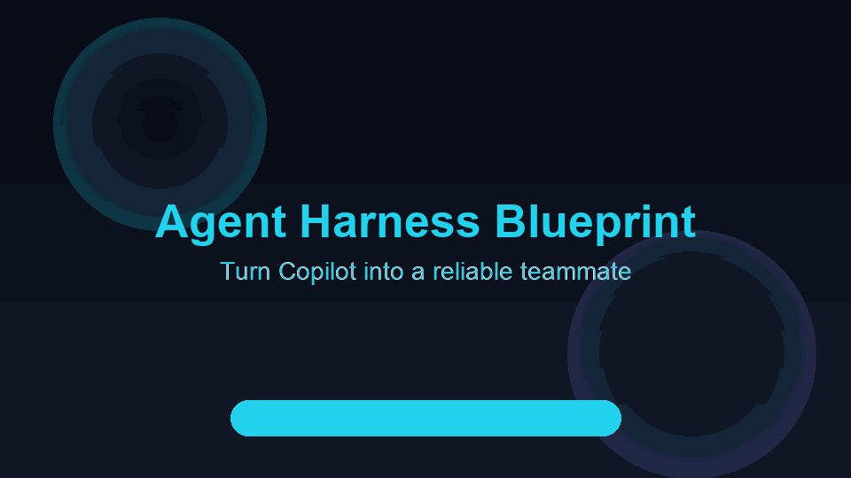

<div align="center">


# Agent Harness Blueprint

### Turn VS Code Copilot into a reliable teammate — and *measure* it

[](https://dharmik2510.github.io/agent-harness-blueprint/)
[](#the-harness-scorecard)
[](LICENSE)
[](docs/start-here/setup-copilot.md)

**A measurable course · score → learn → build → prove · 9 modules · 6 labs · copy-ready templates**

[Score your repo](https://dharmik2510.github.io/agent-harness-blueprint/diagnose) · [Start learning](https://dharmik2510.github.io/agent-harness-blueprint/start-here/quick-start) · [Lab 01](https://dharmik2510.github.io/agent-harness-blueprint/labs/lab-01-baseline-vs-harness)



</div>

---

## Why this exists

Copilot writes code fast. It also says **"done"** when tests are red, forgets yesterday's session, and refactors three things at once.

**Harness engineering** fixes that — not with longer prompts, but with a **Reliability Loop** built into your repo:

```
Bootstrap → Scope → Build → Verify → Handoff → (repeat)
```

Most courses *tell* you about reliability. This one makes it **measurable**: you score your repo, learn the weakest pillar, build it for real, and re-score to prove the gain.

## The Harness Scorecard

The spine of the whole course. **One rubric, two surfaces** — a browser quiz and a CLI — so they can never disagree.

```bash
# Grade any repo against the five pillars (0–100):
git clone https://github.com/Dharmik2510/agent-harness-blueprint
cd agent-harness-blueprint && npm install
npm run score -- /path/to/your/repo
```

```
  Harness Scorecard
  ─────────────────
  42/100 (42%)  Partial harness

  📜 Instructions  ██████░░░░░░ 10/20
  🧠 State         ████░░░░░░░░  5/20
  ✅ Verification  ████████████ 20/20
  🎯 Scope        ██░░░░░░░░░░  5/20  ← weakest
  🔁 Lifecycle    ████░░░░░░░░  5/20

  Fix next:
  ✗ Is there a rule telling the agent to work on one feature at a time?  (+5, Scope)
```

Prefer zero install? Take the **[interactive scorecard](https://dharmik2510.github.io/agent-harness-blueprint/diagnose)** in your browser. This repo dogfoods its own rubric and scores **100/100** in CI.

## The four-stage journey

| Stage | What you do | Go here |
|-------|-------------|---------|
| **① Diagnose** | Score your repo, find your weakest pillar | [/diagnose](https://dharmik2510.github.io/agent-harness-blueprint/diagnose) |
| **② Learn** | 9 short chapters, one per pillar | [Modules](https://dharmik2510.github.io/agent-harness-blueprint/modules/) |
| **③ Build** | Labs that emit real harness files | [Labs](https://dharmik2510.github.io/agent-harness-blueprint/labs/) |
| **④ Prove** | Re-score — the number going up is the proof | [/diagnose](https://dharmik2510.github.io/agent-harness-blueprint/diagnose) |

## The five pillars

<table>
<tr>
<td align="center"><b>📜 Instructions</b><br><sub>AGENTS.md · copilot-instructions</sub></td>
<td align="center"><b>🧠 State</b><br><sub>PROGRESS · feature_list</sub></td>
<td align="center"><b>✅ Verification</b><br><sub>tests · lint · build · CI</sub></td>
</tr>
<tr>
<td align="center"><b>🎯 Scope</b><br><sub>one feature at a time</sub></td>
<td align="center"><b>🔁 Lifecycle</b><br><sub>init.sh · handoff</sub></td>
<td align="center"><a href="https://dharmik2510.github.io/agent-harness-blueprint/"><b>Full course →</b></a></td>
</tr>
</table>

## Quick start (local)

```bash
git clone https://github.com/Dharmik2510/agent-harness-blueprint.git
cd agent-harness-blueprint
npm install
npm run docs:dev    # → http://localhost:5173/agent-harness-blueprint/
npm test            # scorecard CLI unit tests
npm run score -- .  # grade this repo (or any path)
```

**Drop the harness into your project:**

```bash
cp -r templates/universal/* /path/to/your/repo/
cp templates/copilot/minimal/copilot-instructions.md /path/to/your/repo/.github/
npm run score -- /path/to/your/repo     # see your new score
```

## What's inside

| Folder | What |
|--------|------|
| [`scorecard/`](./scorecard/) | The rubric + `harness-score` CLI (one source of truth) |
| [`docs/`](./docs/) | VitePress course site (modules, labs, Copilot guide, scorecard) |
| [`templates/`](./templates/) | Universal + Copilot + Cursor harness packs |
| [`labs/knowledge-hub/`](./labs/knowledge-hub/) | React app the labs build on |
| [`skills/harness-scaffolder/`](./skills/harness-scaffolder/) | Agent skill to scaffold harnesses |

## Scripts

```bash
npm run docs:dev      # local preview
npm run docs:build    # production build (also fails on dead links)
npm test              # scorecard CLI + rubric tests
npm run score -- .    # grade a repo against the five pillars
```

Live site: **https://dharmik2510.github.io/agent-harness-blueprint/**

## Contributing

Issues and PRs welcome — see [CONTRIBUTING.md](./CONTRIBUTING.md) and the [Code of Conduct](./CODE_OF_CONDUCT.md). Good first contributions: a new lab, a translated module, or a new `detect` rule for the rubric.

## License

MIT — see [LICENSE](./LICENSE). Further reading and references in [ATTRIBUTION.md](./ATTRIBUTION.md).
