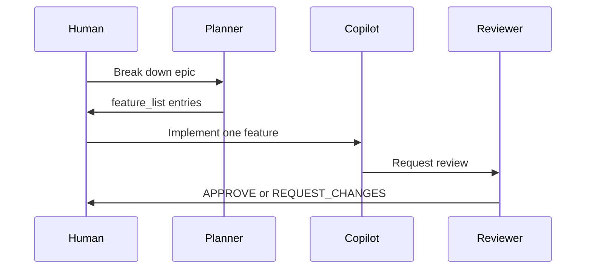

# Copilot custom agents

*~8 min read*

Custom agents are specialized personas in `.github/agents/*.agent.md`.

## When to use

| Scenario | Agent |
|----------|-------|
| Implementation | Default Copilot chat with `copilot-instructions.md` |
| Pre-merge review | `reviewer.agent.md` |
| Task breakdown | `planner.agent.md` |
| Challenge assumptions | `critic.agent.md` |

## Example: reviewer

Copy from [templates/copilot/minimal/agents/reviewer.agent.md](https://github.com/Dharmik2510/agent-harness-blueprint/blob/main/templates/copilot/minimal/agents/reviewer.agent.md).

Invoke from Copilot Chat agent picker or `@reviewer` (depending on VS Code version).

## Harness-aligned planner (optional)

Create `.github/agents/planner.agent.md`:

```markdown
---
name: planner
description: Breaks epics into feature_list.json entries
---

Break the user's request into features for feature_list.json.
Each feature needs: id, title, status "open", acceptance criteria with verifiable checks.
Do not implement code — only output JSON and rationale.
```

## Multi-agent workflow



## Create with AI

Use `/create-agent` in Copilot Chat to scaffold new agents.

## Related

- [Lab 05 — Verification gates](../../labs/lab-05-verification-gates)
