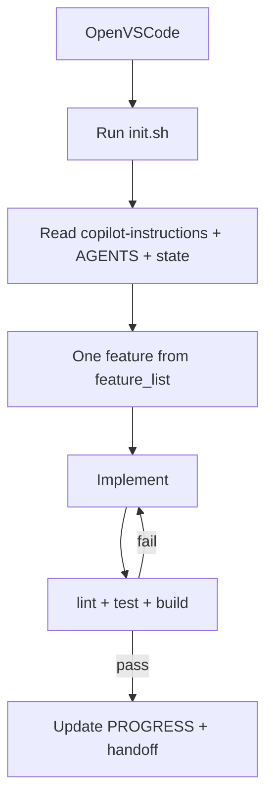

# Copilot harness guide

VS Code Copilot is the **primary agent** for this course. This guide maps harness pillars to Copilot customization features.

## Why a separate track?

Copilot uses specific file paths and slash commands. Your org likely already has licenses — meet them where they are instead of asking everyone to switch tools.

## The five pillars in Copilot

| Pillar | Copilot mechanism |
|--------|-------------------|
| Instructions | `copilot-instructions.md`, `*.instructions.md`, `AGENTS.md` |
| State | `PROGRESS.md`, `feature_list.json` (repo files, not Copilot-native) |
| Verification | Commands in instructions + scoped test rules |
| Scope | Rules + `feature_list.json` |
| Lifecycle | `init.sh` + handoff checklist in instructions |

## Quick start

1. [Setup: VS Code Copilot](/start-here/setup-copilot)
2. Copy [templates/copilot/minimal](https://github.com/Dharmik2510/agent-harness-blueprint/tree/main/templates/copilot/minimal)
3. Run `bash scripts/validate-harness.sh`

## Deep dives

- [Instructions files](./instructions)
- [Custom agents](./custom-agents)
- [Skills and hooks](./skills-and-hooks)
- [Organization rollout](./org-rollout)

## Session diagram

