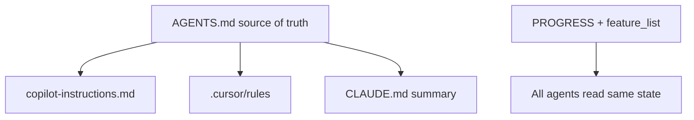

# Provider comparison

*~5 min read*

Harness pillars are **tool-agnostic**. Only file locations and feature names differ.

## Instruction surfaces

| Entity | GitHub Copilot | Cursor | Claude Code | OpenAI Codex |
|--------|----------------|--------|-------------|--------------|
| Global instructions | `.github/copilot-instructions.md` | `.cursor/rules`, `AGENTS.md` | `CLAUDE.md` | `AGENTS.md` |
| Scoped rules | `.github/instructions/*.instructions.md` | `.cursor/rules/*.mdc` | `.claude/rules/` | — |
| Portable manual | `AGENTS.md` | `AGENTS.md` | `AGENTS.md` | `AGENTS.md` |

## Skills

| Tool | Path |
|------|------|
| Copilot | `.github/skills/<name>/SKILL.md` |
| Cursor | `.cursor/skills/<name>/SKILL.md` |
| Claude Code | `.claude/skills/<name>/SKILL.md` |
| Codex | `.codex/skills/<name>/SKILL.md` |

## Subagents

| Tool | Path |
|------|------|
| Copilot | `.github/agents/<name>.agent.md` |
| Cursor | `.cursor/agents/<name>.md` |
| Claude Code | `.claude/agents/<name>.md` |
| Codex | `.codex/config.toml` (`agents.*`) |

## Hooks & MCP

| Entity | Copilot | Cursor | Claude Code | Codex |
|--------|---------|--------|-------------|-------|
| Hooks | `.github/hooks/` | `.cursor/hooks.json` | `.claude/settings.json` | `.codex/config.toml` |
| MCP | `.vscode/mcp.json` | `.cursor/mcp.json` | `.mcp.json` | `.codex/config.toml` |

## Universal files (all tools)

Copy from [`templates/universal`](https://github.com/Dharmik2510/agent-harness-blueprint/tree/main/templates/universal):

- `PROGRESS.md`
- `feature_list.json`
- `SESSION_HANDOFF.md`
- `scripts/init.sh`

## Mixed-team strategy

1. One `AGENTS.md` for facts (stack, verify commands, architecture links)
2. Tool wrappers add session rituals only
3. Never duplicate conflicting rules across files

## Multi-provider CLI tools

Tools like [agent-harness](https://github.com/madebywild/agent-harness) generate provider-specific outputs from one source — useful at scale. This course teaches manual setup first so teams understand each file's purpose.

## Related

- [Setup: Other Agents](/start-here/setup-other-agents)
- [Copilot guide](./copilot/)
