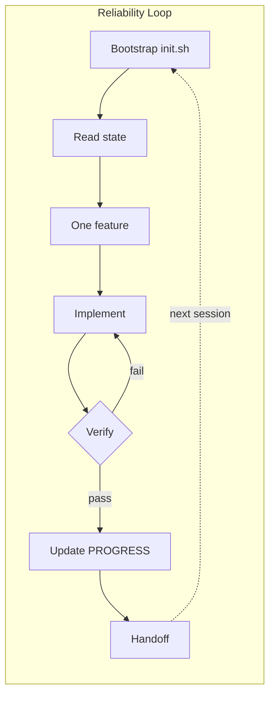

<div style="text-align:center;margin:1.5rem auto 2rem;max-width:720px">


*5-second overview — Reliability Loop, five pillars, 15-minute quick start*

</div>

## Start by measuring

You can't improve what you don't measure. The **Harness Scorecard** grades any repo against the five pillars — in the browser, or against a real repo from your terminal. Every module and lab is tied to it, so learning visibly moves the number.

<div style="text-align:center;margin:1rem auto 0">
  <a class="ahb-score-cta" href="./diagnose">🩺 Score your repo in 2 minutes →</a>
</div>

```bash
# Or grade a real repo right now:
npx --yes harness-score .
```

## One path, four stages

This isn't a reading list — it's a measurable loop. Diagnose where you stand, learn the pillar that hurts, build it for real, then prove the gain.

<Journey />

## The five pillars

Every score, module, and lab maps to these five. Click any pillar to jump to its chapter.

<Pillars />

## The Reliability Loop

Most agent failures are not “bad model” problems. They are **missing systems** problems — a rhythm the agent repeats every session.



::: tip Smart intern metaphor
Think of Copilot as a fast intern with amnesia. Your harness is the **onboarding binder** — tasks, rules, proof, and handoff notes that survive every new chat window.
:::

## What makes this course different

| You get | Typical agent tutorials |
|---------|-------------------------|
| Copilot-specific files and prompts | Generic “write a better prompt” |
| Copy-ready template packs | Theory only |
| Side-by-side lab comparisons | Single happy-path demo |
| Failure mode lookup table | Blame the model |
| 9 focused modules (~8 min each) | Marathon lecture series |

## New here?

1. [Glossary](./start-here/glossary) — plain-language terms
2. [Quick start](./start-here/quick-start) — working harness in 15 minutes
3. [Module F1](./modules/f1-when-the-model-is-not-the-problem) — why capability ≠ reliability
