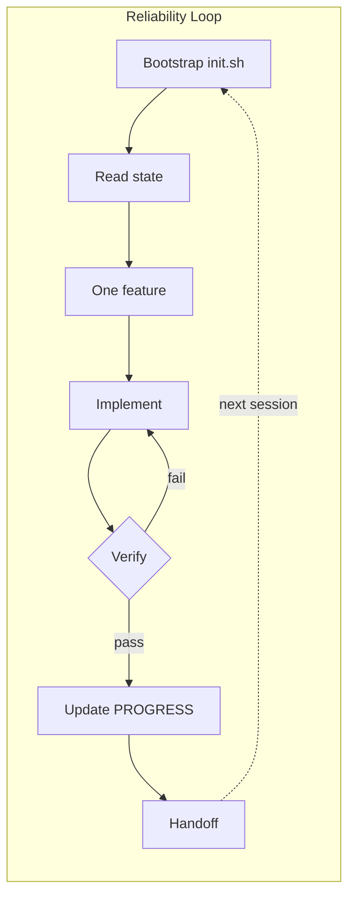

## Pick your path

<a class="ahb-card" href="./start-here/quick-start">
  15 minutes
  <strong>Quick start</strong>
  Copy templates, run validate, fix your repo today.
</a>

<a class="ahb-card" href="./modules/">
  ~8 hrs read
  <strong>Module track</strong>
  10 short chapters from “why agents fail” to full harness design.
</a>

<a class="ahb-card" href="./labs/lab-01-baseline-vs-harness">
  Hands-on
  <strong>Lab track</strong>
  Build muscle memory on the Knowledge Hub app.
</a>

<a class="ahb-card" href="./guide/copilot/">
  Copilot deep dive
  <strong>VS Code guide</strong>
  Instructions, agents, skills, hooks, and org rollout.
</a>

## The Reliability Loop

Most agent failures are not “bad model” problems. They are **missing systems** problems.

  

1

Bootstrap

  

2

Scope

  

3

Build

  

4

Verify

  

5

Handoff

::: tip Smart intern metaphor
Think of Copilot as a fast intern with amnesia. Your harness is the **onboarding binder** — tasks, rules, proof, and handoff notes that survive every new chat window.
:::

## What makes this course different

| You get | Typical agent tutorials |
|---------|-------------------------|
| Copilot-specific files and prompts | Generic “write a better prompt” |
| Copy-ready template packs | Theory only |
| Side-by-side lab comparisons | Single happy-path demo |
| Failure mode lookup table | Blame the model |
| 10 focused modules (~8 min each) | Marathon lecture series |

## New here?

1. [Glossary](./start-here/glossary) — plain-language terms
2. [Quick start](./start-here/quick-start) — working harness in 15 minutes
3. [Module 01](./modules/m01-when-the-model-is-not-the-problem) — why capability ≠ reliability
