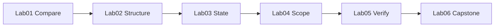

# Lab catalog

Six hands-on labs on the **Knowledge Hub** app — a Vite + React document search project. Each lab adds one harness skill you will use at work.

::: warning Learn by contrast
Lab 01 deliberately runs Copilot **without** a harness first. The mess you see is the lesson.
:::

<div class="ahb-bento">

<a class="ahb-card" href="./lab-01-baseline-vs-harness">
  <span class="ahb-pill">Lab 01 · 45 min</span>
  <strong>Baseline vs harness</strong>
  <span>Same task, two runs — measure the verification gap.</span>
</a>

<a class="ahb-card" href="./lab-02-agent-readable-workspace">
  <span class="ahb-pill">Lab 02 · 1 hr</span>
  <strong>Agent-readable workspace</strong>
  <span>Doc maps, scoped Copilot instructions, short root files.</span>
</a>

<a class="ahb-card" href="./lab-03-multi-session-continuity">
  <span class="ahb-pill">Lab 03 · 1 hr</span>
  <strong>Multi-session continuity</strong>
  <span>Two chats, zero verbal recap — PROGRESS.md only.</span>
</a>

<a class="ahb-card" href="./lab-04-scope-control">
  <span class="ahb-pill">Lab 04 · 1 hr</span>
  <strong>Scope control</strong>
  <span>Survive the “while you're at it…” trap prompt.</span>
</a>

<a class="ahb-card" href="./lab-05-verification-gates">
  <span class="ahb-pill">Lab 05 · 1 hr</span>
  <strong>Verification gates</strong>
  <span>Force real test runs before “done”.</span>
</a>

<a class="ahb-card" href="./lab-06-full-harness-capstone">
  <span class="ahb-pill">Lab 06 · 2 hrs</span>
  <strong>Full harness capstone</strong>
  <span>Complete system + ablation study.</span>
</a>

</div>

## App repo path

```bash
cd labs/knowledge-hub
npm install
npm run dev   # http://localhost:5174
```

## Lab progression



Each lab's solution becomes the next lab's starting point — the app and harness mature together.
