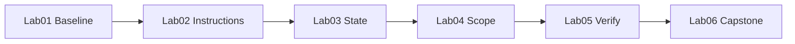

# Lab catalog

This is the **③ Build** stage. You've diagnosed your gaps and learned the pillars — now you build the harness for real.

Every lab runs on the **Knowledge Hub** React app (Vite + React document search) and produces actual harness files — instruction maps, `PROGRESS.md`, scope lists, verification gates. Each file you ship raises your **Harness Scorecard**.

::: warning Learn by contrast
Lab 01 deliberately runs the agent **without** a harness first. The mess you see is the lesson — then you measure it and fix it.
:::

::: tip Know your target
Each lab aims at a specific pillar score. **[Score your harness → /diagnose](/diagnose)** before and after to watch the number climb.
:::

<div class="ahb-bento">

<a class="ahb-card" href="./lab-01-baseline-vs-harness">
  <span class="ahb-pill">Lab 01 · the whole loop</span>
  <strong>Baseline vs harness</strong>
  <span>Same task, two runs. Run the measure → improve cycle and feel the gap.</span>
</a>

<a class="ahb-card" href="./lab-02-agent-readable-workspace">
  <span class="ahb-pill">Lab 02 · 📜 Instructions → 20/20</span>
  <strong>Agent-readable workspace</strong>
  <span>Doc maps, scoped instructions, short root files the agent actually reads.</span>
</a>

<a class="ahb-card" href="./lab-03-multi-session-continuity">
  <span class="ahb-pill">Lab 03 · 🧠 State → 20/20</span>
  <strong>Multi-session continuity</strong>
  <span>Two chats, zero verbal recap. PROGRESS.md carries the work forward.</span>
</a>

<a class="ahb-card" href="./lab-04-scope-control">
  <span class="ahb-pill">Lab 04 · 🎯 Scope → 20/20</span>
  <strong>Scope control</strong>
  <span>Survive the “while you're at it…” trap. One feature at a time.</span>
</a>

<a class="ahb-card" href="./lab-05-verification-gates">
  <span class="ahb-pill">Lab 05 · ✅ Verification → 20/20</span>
  <strong>Verification gates</strong>
  <span>Force real test runs before “done.” Proof beats confidence.</span>
</a>

<a class="ahb-card" href="./lab-06-full-harness-capstone">
  <span class="ahb-pill">Lab 06 · all pillars → 90+/100</span>
  <strong>Full harness capstone</strong>
  <span>Wire every pillar together, run the ablation study, prove the score.</span>
</a>

</div>

## At a glance

| Lab | Pillar focus | Target score | Pairs with module |
|-----|--------------|--------------|-------------------|
| [Lab 01 — Baseline vs harness](./lab-01-baseline-vs-harness) | The whole loop / baseline | Measure → improve | [F2 — The harness & the scorecard](../modules/f2-the-harness-and-the-scorecard) |
| [Lab 02 — Agent-readable workspace](./lab-02-agent-readable-workspace) | 📜 Instructions | 20/20 | [P1 — Instructions](../modules/p1-instructions) |
| [Lab 03 — Multi-session continuity](./lab-03-multi-session-continuity) | 🧠 State | 20/20 | [P2 — State](../modules/p2-state) |
| [Lab 04 — Scope control](./lab-04-scope-control) | 🎯 Scope | 20/20 | [P4 — Scope](../modules/p4-scope) |
| [Lab 05 — Verification gates](./lab-05-verification-gates) | ✅ Verification | 20/20 | [P3 — Verification](../modules/p3-verification) |
| [Lab 06 — Full harness capstone](./lab-06-full-harness-capstone) | All pillars | 90+/100 | [O2 — Team rollout](../modules/o2-team-rollout) |

## App repo path

```bash
cd labs/knowledge-hub
npm install
npm run dev   # http://localhost:5174
```

## Lab progression



Each lab's solution becomes the next lab's starting point — the app and your harness mature together, and the scorecard climbs with every gate you add.
