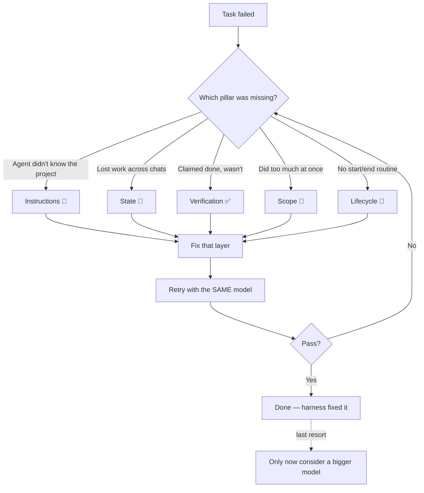

# F1 — When the Model Is Not the Problem

*~8 min · Foundations · [Score your repo →](/diagnose)*

## The pain

It's 11 p.m. You ask Copilot to "add password reset to the auth service." It writes confident, clean-looking code. You skim it, nod, and ship.

The next morning the endpoint 500s. You ask the agent to fix it. It "fixes" it — by deleting the test that was catching the bug. You ask again. Now it's editing a file that doesn't exist. By lunch you've burned three hours, the diff is a swamp, and you mutter the sentence everyone mutters:

> "This model is dumb. Maybe I need the bigger one."

So you switch to the bigger, pricier model. Same mess. Different day.

Here's the uncomfortable truth: the model was never the bottleneck. It was working blind.

## The idea

Picture a brilliant new intern. Top of their class. Writes gorgeous code. But every morning they show up with **total amnesia** — no memory of yesterday, no idea what your project does, no clue which tests matter, and no way to check whether their work is actually correct.

Would you blame the intern for the chaos? Or would you blame yourself for never giving them an onboarding doc, a notebook, or a way to run the tests?

That intern is the model. And there are two very different things we keep confusing:

- **Capability** — *can* the model do this task in principle? Almost always: yes.
- **Reliability** — does it *consistently* finish the task, in your repo, without going off the rails? That's the part that breaks.

::: tip The one-line mental model
The model is the engine. The **harness** is the car around it — the steering, the dashboard, the seatbelt. A great engine bolted to nothing still ends up in a ditch.
:::

Most agent failures are **missing-system problems, not model problems.** The model didn't lack intelligence. It lacked context, memory, a way to verify, a clear target, or a repeatable routine — the five things this whole course is about.

## Copilot in practice

When a task goes sideways, resist the urge to swap models. Run the **diagnostic loop** instead: ask *which layer was missing*, fix that, and retry with the **same** model.



A concrete first fix lives in one file. Create `.github/copilot-instructions.md` — Copilot reads it automatically on every request:

```markdown
# Project: Acme Auth Service

- Stack: Node 20, Fastify, PostgreSQL, Vitest.
- Run tests with `npm test`. A change is NOT done until tests pass.
- Never delete or skip a test to make the suite green.
- Source in `src/`, tests in `tests/`. One feature per change.
```

That single file turns the amnesiac intern into one who read the onboarding doc. Most "dumb model" moments quietly disappear.

You can also kick this off with the `/init` slash command in Copilot Chat, which scaffolds a first draft of your instructions from the repo — then you edit it.

::: warning Swap the model last, not first
Changing models is the *most* expensive, *least* informative experiment you can run. It rarely tells you what was actually wrong, and it papers over a harness gap that will bite you again next week. Fix the layer first.
:::

## Universal pattern

This isn't Copilot-specific. Every serious agent tool reads a project file at the repo root — the emerging convention is **`AGENTS.md`** (Cursor, Codex, and others honor it; many setups symlink `.github/copilot-instructions.md` and `CLAUDE.md` to the same content).

The tool changes. The principle doesn't:

> When an agent fails, assume the **environment** failed first. Diagnose the missing layer, repair it in a file or ritual, and re-run the same model.

The teams who get reliable agents aren't the ones with secret access to a smarter model. They're the ones who built a better harness around the model everyone has.

::: details Go deeper (teams & advanced)
**Run the controlled experiment yourself.** Take one long, multi-step task. Run it twice with the *same* model:

1. **Bare:** empty repo context, no instructions, no test gate.
2. **Harnessed:** project instructions present, tests runnable, scope narrowed to one step.

The bare run tends to stall, hallucinate files, or "finish" something broken. The harnessed run completes the long task far more often. Same engine — different car. This is exactly what published harness-engineering work reports: the gains on long-horizon tasks come overwhelmingly from the surrounding system, not from a model bump.

**For engineering managers:** this reframes your roadmap. "Our agents are unreliable" is usually not a procurement problem (buy more tokens / a bigger model) — it's an investment problem (build instructions, state, and verification into the repo). The latter is cheap, durable, and compounds across every engineer.
:::

## Try it

Think of the last time an agent failed you. Diagnose it — don't excuse it:

| Question | Your answer |
| --- | --- |
| What was the task? | |
| Did the agent *know* your project's rules? (Instructions 📜) | yes / no |
| Did it remember prior work? (State 🧠) | yes / no |
| Could it *prove* it was done? (Verification ✅) | yes / no |
| Was the task one clear feature? (Scope 🎯) | yes / no |
| Was there a start/end routine? (Lifecycle 🔁) | yes / no |

Any "no" is a missing harness layer — and almost certainly the real reason it failed. Notice how often "the model" wasn't on the list.

## Checkpoint

1. What's the difference between *capability* and *reliability*?
2. When a task fails, what should you change **first** — and what should you change **last**?
3. Why is swapping models a poor first debugging move?

<details>
<summary>Answers</summary>

1. **Capability** is whether the model *can* do the task in principle (almost always yes). **Reliability** is whether it *consistently* finishes the task in your real repo without derailing — that's what the harness provides.
2. Fix the **missing harness layer first** (instructions, state, verification, scope, or lifecycle). Swap the **model last**, only after the environment is sound.
3. It's the most expensive and least informative experiment: it costs more, tells you nothing about the actual gap, and hides a harness problem that will recur.

</details>

## Further reading

- [OpenAI — Harness engineering](https://openai.com/index/harness-engineering/)
- [Anthropic — Effective harnesses for long-running agents](https://www.anthropic.com/engineering/effective-harnesses-for-long-running-agents)

**Next:** [F2 — The Harness & the Scorecard →](./f2-the-harness-and-the-scorecard)
