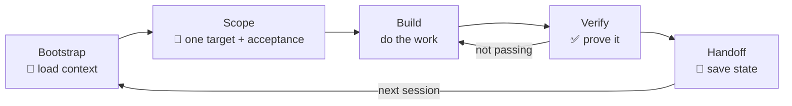

# F2 — The Harness & the Scorecard

*~8 min · Foundations · [Score your repo →](/diagnose)*

## The pain

You read F1 and you're sold: fix the environment, not the model. Great. So you do the obvious thing — you write a *longer prompt*.

You paste in your stack. You add "please be careful." You add "don't break the tests." You add a paragraph about your folder structure. The prompt is now a wall of text you copy into every single chat.

It helps for about a day. Then you open a fresh window and... it's gone. You paste it again. You tweak it. Now there are four slightly different versions of "the prompt" floating around, none of them in the repo, none of them shared with your teammate, none of them remembered by the agent tomorrow.

A longer prompt isn't a harness. It's a sandcastle you rebuild every morning.

## The idea

A **harness** is the set of **files and rituals around the model** that make it reliable — not a bigger prompt, and not a better model.

Think of it as the workshop you build *around* that brilliant-but-amnesiac intern:

- The **onboarding doc** on the wall (so they know the project).
- The **lab notebook** on the bench (so today's work survives until tomorrow).
- The **test rig** by the door (so "done" means *proven*, not *claimed*).
- The **one work order** taped to the desk (so they build one thing, not ten).
- The **open/close checklist** (so every shift starts and ends the same way).

The key shift: a harness lives **in the repo**, in version control, shared by the whole team and re-read by the agent automatically. It's durable. A pasted prompt is not.

These five elements aren't a random list. They're the **Five Pillars**.

## The Five Pillars

Each pillar is worth **/20**, for a total of **100**. Together they answer: *does this repo make an agent reliable?*

**📜 Instructions — the agent knows your project.** A committed file (`.github/copilot-instructions.md` / `AGENTS.md`) that tells the agent your stack, your rules, your conventions, and your test command. Without it, every session starts from zero. With it, the intern has read the onboarding doc.

**🧠 State — work survives the end of a chat window.** A place — a task file, a scratchpad, a plan checked into the repo — where progress, decisions, and "what's next" are written down. Chat windows are mortal; the repo is not. State is the lab notebook that carries work across sessions and across days.

**✅ Verification — "done" means proven, not claimed.** A runnable, trustworthy way to check the work: tests, a typecheck, a build, a lint. The rule that makes it real: *a change isn't done until verification passes — and you never weaken the check to make it green.* This is the test rig that stops the agent from "fixing" bugs by deleting tests.

**🎯 Scope — one feature at a time with clear acceptance.** A narrow, explicit target with a definition of done *before* code is written. Vague tasks ("improve auth") produce sprawling, unreviewable diffs. Scoped tasks ("add password reset endpoint; acceptance: returns 200 + sends email + test passes") produce clean, mergeable changes. One work order at a time.

**🔁 Lifecycle — every session starts and ends the same way.** A repeatable routine: load context at the start, hand off cleanly at the end. No more "where was I?" and no more lost work between chats. The open/close checklist that makes good behavior automatic instead of heroic.

## The Reliability Loop

The pillars come alive as a loop you run every session:



**Bootstrap → Scope → Build → Verify → Handoff → repeat.** Bootstrap and Handoff are the **Lifecycle** pillar bookending every session; State is what Handoff writes and Bootstrap reads. The loop is the same whether the session lasts ten minutes or three days.

::: tip Why a loop and not a checklist
A checklist is something you *try* to remember. A loop is something the harness *makes* happen. The goal is reliability without willpower — the right thing is the easy, default thing.
:::

## The Harness Scorecard

Here's the part that turns all of this from philosophy into practice: you can **measure** it.

The **Harness Scorecard** scores any repo **0–100** across the five pillars (each /20). It reads what's actually in your repo — Do you have an instructions file? A state mechanism? A verification command? Evidence of scoping? A session routine? — and hands you a number plus your **weakest pillar**.

That weakest pillar is the most valuable sentence in this course. It tells you *exactly* where your next hour of effort buys the most reliability. You don't guess. You don't gold-plate the pillar that's already strong. You fix the floor that's dragging everything down.

::: warning A high score isn't vanity
The score is a proxy for "how reliably can an agent finish real work here." Going from 40 to 75 is the difference between fighting the agent and trusting it on a long task. The number is the means; reliability is the end.
:::

**Score yours now → [/diagnose](/diagnose)** (interactive), or from your terminal:

```bash
npx harness-score .
```

This whole course is built around moving that number: **Diagnose → Learn → Build → Prove.** You diagnose to find the weakest pillar, learn the pattern for it, build it into your repo, and prove the score went up.

### Each pillar has a module

| Pillar | What it gives the agent | Module |
| --- | --- | --- |
| 📜 Instructions | Knowledge of your project | [/modules/p1-instructions](/modules/p1-instructions) |
| 🧠 State | Memory across sessions | [/modules/p2-state](/modules/p2-state) |
| ✅ Verification | Proof of "done" | [/modules/p3-verification](/modules/p3-verification) |
| 🎯 Scope | One clear target | [/modules/p4-scope](/modules/p4-scope) |
| 🔁 Lifecycle | A repeatable routine | [/modules/p5-lifecycle](/modules/p5-lifecycle) |

::: details Go deeper (teams & advanced)
**The score is a shared language.** "Our auth repo is a 45, weakest pillar Verification" is a sentence an entire team can act on — far better than "the AI is flaky." It turns a vibe into a backlog item.

**It compounds.** Unlike a model upgrade (which you pay for forever and which resets nothing in your repo), harness work is a one-time investment per repo that every engineer and every agent benefits from, on every task, indefinitely. The pillars also reinforce each other: good Scope makes Verification cheap; good State makes Lifecycle effortless; good Instructions makes everything else land.

**Use it as a gate.** Some teams set a minimum score (say, 60) before they let agents touch a repo unsupervised, and track the score over time the way they track test coverage.
:::

## Try it

Before you open `/diagnose`, predict your own scores. Then run the real thing and compare — the gaps are where your instincts are wrong.

| Pillar | Guess (/20) | Actual (/20) |
| --- | --- | --- |
| 📜 Instructions | | |
| 🧠 State | | |
| ✅ Verification | | |
| 🎯 Scope | | |
| 🔁 Lifecycle | | |
| **Total** | **/100** | **/100** |

Circle your lowest **actual** pillar. That's the module you should do next after Foundations.

## Checkpoint

1. Why isn't a longer prompt a harness?
2. Name the five pillars and what each one gives the agent.
3. What's the single most useful output of the Scorecard, and why?

<details>
<summary>Answers</summary>

1. A long prompt isn't versioned, isn't shared, and isn't remembered — you rebuild it every session. A harness is **files and rituals in the repo**: durable, shared, and re-read automatically.
2. **📜 Instructions** (knowledge of the project), **🧠 State** (memory across sessions), **✅ Verification** (proof of done), **🎯 Scope** (one clear target with acceptance), **🔁 Lifecycle** (a repeatable start/end routine).
3. Your **weakest pillar** — it tells you exactly where the next hour of effort buys the most reliability, so you fix the real bottleneck instead of polishing what's already strong.

</details>

## Further reading

- [OpenAI — Harness engineering](https://openai.com/index/harness-engineering/)
- [Anthropic — Effective harnesses for long-running agents](https://www.anthropic.com/engineering/effective-harnesses-for-long-running-agents)

**Next:** [P1 — Instructions →](./p1-instructions)
