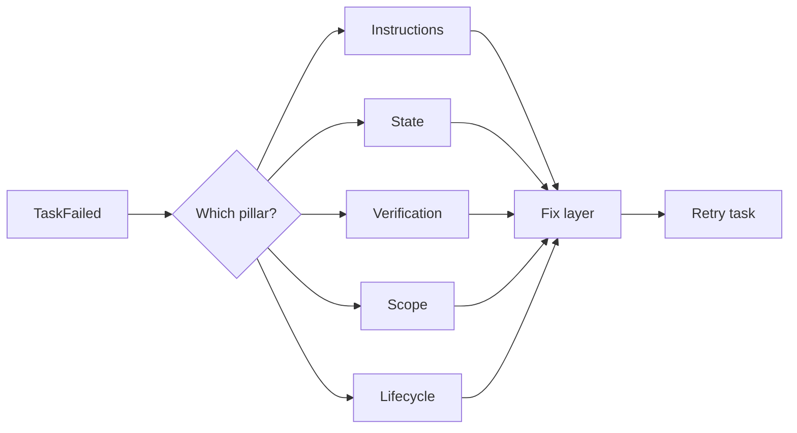

# M01 — When the model is not the problem

*~8 min read · Part 1 — Foundations · Prerequisites: [Glossary](../start-here/glossary)*

## The problem

You ask Copilot to add a search endpoint. Twenty minutes later it says **"All done!"** You pull the branch: tests are red, error handling does not match your API style, and pagination works differently than your product spec.

Your first instinct: *"I need a smarter model."*

Often, the model was capable enough. The **environment** was not.

## The idea

**Capability** and **reliability** are different skills.

- *Capability* — can the model write reasonable code for a well-defined task?
- *Reliability* — does it finish the *right* task, in *your* repo, with *proof*, across sessions?

Think of a smart intern. They can code. Without an onboarding binder, written conventions, and a checklist before they leave, they will guess — and guess wrong.

Research teams (Anthropic, OpenAI) ran controlled experiments: **same model**, with vs without a structured harness. Bare runs produced broken output quickly. Harnessed runs produced working software over longer horizons. The model did not change. The **system around it** did.

When something fails, use the **diagnostic loop**: fix the harness layer first, swap models last.



## Copilot in practice

Add this block to `.github/copilot-instructions.md`:

```markdown
## Before claiming done
- Run verification commands listed in AGENTS.md
- Do not mark tasks complete if tests or lint fail
- When requirements are vague, ask clarifying questions first
```

This single addition addresses the **verification gap** — one of the top Copilot failure modes.

## Universal pattern

Create `AGENTS.md` at repo root with:

1. Project purpose (2–3 sentences)
2. Tech stack with **versions**
3. Non-negotiable constraints
4. Verification commands (copy-pasteable)
5. Links to deeper docs — not the full encyclopedia

One well-written `AGENTS.md` often beats upgrading to a more expensive model.

## Try it

Pick a small task in a repo you know. Run Copilot **without** harness files. Note failures. Add `AGENTS.md` with explicit verification commands. Run the **same** task. Compare:

| Run | Agent claimed done? | Actually correct? | Time to fix |
|-----|---------------------|-------------------|-------------|
| Without harness | | | |
| With AGENTS.md | | | |

## Checkpoint

1. What is the difference between capability and reliability?
2. Name two failure modes that are harness problems, not model problems.
3. What is the first file you should add to most repos?

<details>
<summary>Answers</summary>

1. Capability is whether the model *can* do the task; reliability is whether it *does* in your real environment with proof.
2. Examples: no verification commands; implicit team conventions not written down; cross-session amnesia.
3. `AGENTS.md` (plus tool-specific mirror like `copilot-instructions.md`).

</details>

## Further reading

- [OpenAI: Harness engineering](https://openai.com/index/harness-engineering/)
- [Anthropic: Effective harnesses for long-running agents](https://www.anthropic.com/engineering/effective-harnesses-for-long-running-agents)
- Next: [M02 — What a harness really is](./m02-what-a-harness-really-is)
