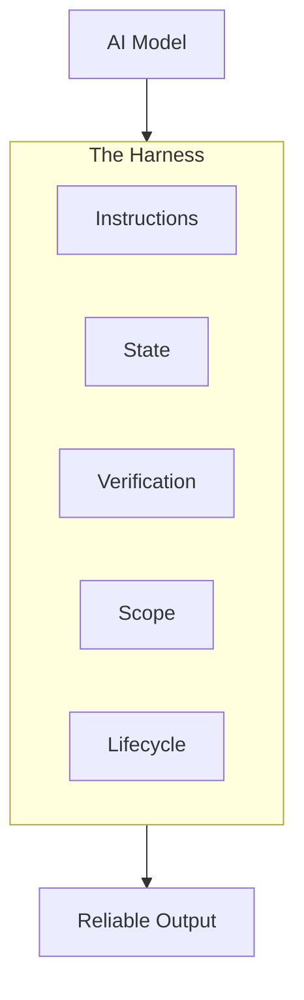

# M02 — What a harness really is

*~8 min read · Part 1 — Foundations · Prerequisites: [M01](./m01-when-the-model-is-not-the-problem)*

## The problem

People say "we added a harness" when they dropped a 400-line prompt into a markdown file. The agent still drifts, forgets, and declares victory early.

**A prompt file is not a harness.**

## The idea

A harness is the **full working environment** around the model:



| Subsystem | Job | Example artifacts |
|-----------|-----|-------------------|
| Instructions | What to do, what to read | `AGENTS.md`, `copilot-instructions.md` |
| State | Remember progress | `PROGRESS.md`, `feature_list.json` |
| Verification | Prove correctness | test/lint/smoke commands in instructions |
| Scope | Limit current work | one open feature, definition of done |
| Lifecycle | Start and end rituals | `init.sh`, session handoff |

**The model decides what code to write. The harness decides when, where, and whether it counts as done.**

Everything that is not model weights is harness: your repo layout, CI config, init scripts, progress logs, and the habits you enforce in instructions.

## Copilot in practice

Copilot's harness surfaces in VS Code:

| Layer | Copilot file |
|-------|--------------|
| Instructions | `.github/copilot-instructions.md`, `.github/instructions/*.instructions.md` |
| Role split | `.github/agents/*.agent.md` |
| Reusable flows | `.github/skills/*/SKILL.md` |
| Tooling | `.vscode/mcp.json` |
| Guardrails | `.github/hooks/` (preview) |

Start with **instructions + verification** in `copilot-instructions.md`. Add agents and skills when one persona is not enough.

## Universal pattern

Minimum viable harness (four files + one script):

```text
your-repo/
├── AGENTS.md
├── PROGRESS.md
├── feature_list.json
├── SESSION_HANDOFF.md
└── scripts/init.sh
```

Copy the pack from [`templates/universal/`](https://github.com/Dharmik2510/agent-harness-blueprint/tree/main/templates/universal).

## Try it

Audit a repo you work on. Score each pillar 0–2:

- **0** — missing
- **1** — exists but incomplete
- **2** — clear and enforced

| Pillar | Score | What's missing? |
|--------|-------|-----------------|
| Instructions | | |
| State | | |
| Verification | | |
| Scope | | |
| Lifecycle | | |

Lowest score = highest ROI fix.

## Checkpoint

1. Why is a single giant prompt not a harness?
2. Name all five pillars.
3. Which pillar has the highest ROI for most teams starting out?

<details>
<summary>Answers</summary>

1. It lacks state, verification enforcement, scope boundaries, and session lifecycle — instructions alone cannot close the loop.
2. Instructions, state, verification, scope, lifecycle.
3. Usually **verification** (explicit commands + "do not claim done until pass") or **instructions** (AGENTS.md + copilot-instructions.md).

</details>

## Further reading

- [VS Code Copilot customization](https://code.visualstudio.com/docs/copilot/customization/overview)
- Next: [M03 — The five pillars](./m03-the-five-pillars)
