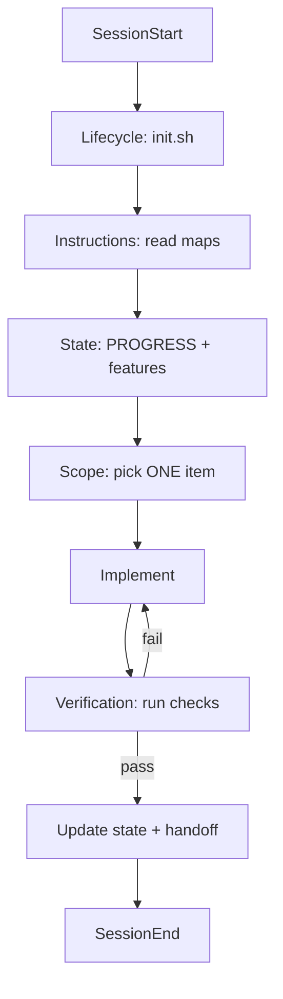

# M03 — The five pillars

*~10 min read · Part 1 — Foundations · Prerequisites: [M02](./m02-what-a-harness-really-is)*

## The problem

Teams add `AGENTS.md` and expect magic. Sessions still fail because they fixed **one** pillar while ignoring the other four.

## The idea

A reliable agent session needs all five pillars working together:



### 1. Instructions

Short operating manual + links. Not an encyclopedia.

### 2. State

Disk-backed memory: what's done, in progress, blocked. Survives chat restarts.

### 3. Verification

Runnable proof: tests, lint, typecheck, smoke curls. **Confidence ≠ correctness.**

### 4. Scope

One feature at a time. Machine-readable feature list the agent should not rewrite casually.

### 5. Lifecycle

Same opening ritual (`init.sh`, read state) and closing ritual (update progress, handoff notes, safe commit).

## Copilot in practice

### Minimal Copilot harness pack

```text
.github/
├── copilot-instructions.md      # pillars 1, 3, 4, 5 rules
├── instructions/
│   └── tests.instructions.md    # scoped test conventions
└── agents/
    └── reviewer.agent.md        # optional verification persona
AGENTS.md                          # portable source of truth
PROGRESS.md
feature_list.json
scripts/init.sh
```

### Copilot quick-start (copy this workflow)

1. Open repo → run `/init` in Copilot Chat
2. Merge with [`templates/copilot/minimal/copilot-instructions.md`](https://github.com/dharmiksoni/agent-harness-blueprint/blob/main/templates/copilot/minimal/copilot-instructions.md)
3. Copy universal templates
4. `bash scripts/init.sh`
5. End every session with `SESSION_HANDOFF.md` checklist

**Session opener prompt:**

```text
Follow the harness lifecycle in AGENTS.md:
1. Run scripts/init.sh
2. Read PROGRESS.md and feature_list.json
3. Work on exactly one "open" feature
4. Run all verification commands before done
5. Update PROGRESS.md
```

## Universal pattern

Validate any repo:

```bash
bash scripts/validate-harness.sh /path/to/repo
```

The script scores each pillar and suggests fixes.

## Try it

Install the minimal pack into a practice repo. Run validation before and after. Target: **no pillar at 0**.

## Checkpoint

1. What happens if you have instructions but no verification pillar?
2. What file enforces scope boundaries?
3. What should happen at the start of every session?

<details>
<summary>Answers</summary>

1. Agent declares done based on confidence; verification gap stays wide.
2. `feature_list.json` (plus scope rules in instructions).
3. Run `init.sh`, read instructions and state files, pick one scoped task.

</details>

## Next steps

- **Hands-on:** [Lab 01 — Baseline vs harness](../labs/lab-01-baseline-vs-harness)
- **Theory continues:** [M04 — Your repo is the agent's memory](./m04-repo-as-source-of-truth)
