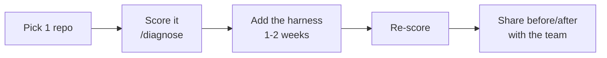

# O2 — Roll it out to your team

*~8 min · Operations · [Score your repo →](/diagnose)*

## The pain

You built a great harness. Your repo scores 90. Your sessions land clean, resume fast, and rarely go off the rails.

Then you look at the rest of the team.

Everyone's prompting from scratch. One teammate has a brilliant instructions file nobody else has seen. Another fights scope creep every afternoon. A third doesn't trust agents at all anymore because their first attempt produced a 40-file mess. Every repo is a different score, every session a different gamble. The wins you've worked out stay trapped in your repo.

A harness that lives in one engineer's project is a hobby. A harness that's the team default is leverage.

## The idea

**Rolling out a harness is a change-management problem, not a coding problem.** You don't win by mandating it. You win by *proving* it, then making the good path the easy path.

Three moves:

1. **Set org-wide defaults** so good instructions reach every repo automatically.
2. **Run a pilot** on one real repo and measure the scorecard before and after — evidence beats opinion.
3. **Make the harness the default** via a starter repo, so new projects are born with it.

The scorecard is your common language. "Our agent setup is bad" starts a debate. "This repo scores 35 on Verification" starts a fix.

## Copilot in practice

**1. Org-wide Copilot custom instructions.** Most teams keep good instructions locked in one repo's `.github/copilot-instructions.md`. Lift the universal rules — the Reliability Loop, state files, scope discipline — to where everyone inherits them:

- **Personal-level instructions** every engineer can enable, plus
- **A shared, copy-paste instructions block** maintained in one place (a docs repo or wiki) that every project pulls from.

```markdown
## Team harness baseline (every repo inherits this)
- Loop: Bootstrap → Scope → Build → Verify → Handoff.
- On startup: run scripts/init.sh, then read SESSION_HANDOFF.md,
  PROGRESS.md, feature_list.json.
- One feature per session. Verify with real output before "done".
- On shutdown: log with pasted evidence, update backlog, rewrite
  handoff, leave git clean.
```

Keep it short. The per-repo instructions file then adds only what's specific to *that* project.

**2. Run a pilot — one repo, measured.** Don't boil the ocean. Pick a single active repo with a willing owner.



Score it on day one (open [/diagnose](/diagnose), or `npm run score -- <path>` from a clone of this repo). Add the harness over a sprint. Re-score. Then show the team the before/after — a 35 that became an 85 is the most persuasive slide you'll ever present.

**3. Measure what managers actually care about.** Engineering leaders don't fund "better vibes." Track outcomes:

| Metric | What it means | Why it matters |
|--------|---------------|----------------|
| **Rework rate** | % of agent changes that get reverted or redone | Falls when scope + verification work |
| **Time-to-green** | Time from "start" to passing verification | Falls when bootstrap + clear scope work |
| **% sessions that finish** | Sessions ending with a clean handoff vs. abandoned | Rises when lifecycle is enforced |

Pair these with the scorecard. The score predicts the outcomes; the outcomes justify the investment.

**4. Make the harness a team default.** The goal is that no one *has* to remember any of this.

- Build a **starter repo** (a GitHub template) preloaded with `scripts/init.sh`, `.github/copilot-instructions.md`, `PROGRESS.md`, `feature_list.json`, and `SESSION_HANDOFF.md`.
- New projects are created *from the template* — born scoring 80+.
- For existing repos, ship a tiny `npx`-able scaffold or a checklist PR that drops the files in.

When the good setup is the default setup, adoption stops being a campaign and becomes just "how we make repos here."

## Go deeper

::: details Teams & advanced
- **Lead with one champion, not a mandate.** A single repo that visibly works converts skeptics faster than any policy. Let the results recruit for you.
- **Make the scorecard visible.** A small badge or a weekly "repo scores" post creates gentle, friendly pressure to climb — gamified in a good way.
- **Don't let baselines rot.** Assign an owner for the shared instructions block. As tools change, the baseline changes once, for everyone.
- **Right-size per repo.** A throwaway script doesn't need a full handoff ritual. A long-lived service does. Push hardest on the repos where sessions actually span days and people.
- **Onboard with the harness.** A new hire who starts in a harnessed repo learns the Reliability Loop by osmosis — the rituals teach themselves.
:::

## Try it

1. Pick **one** repo and score it now: [/diagnose](/diagnose) (or `npm run score -- <path>` from a clone of this repo). Write the number down.
2. Spend a sprint bringing it up — close the lowest pillar first.
3. Re-score, and capture before/after for one outcome metric (start with rework rate or time-to-green).
4. Create a starter template from the repo so the next project inherits the win.

## Checkpoint

1. Why pilot on one repo instead of mandating the harness everywhere at once?
2. Name two metrics an engineering manager would care about, and which pillars move them.
3. What makes a harness a true team *default* rather than a recommendation?

<details>
<summary>Answers</summary>

1. A measured before/after on one repo produces evidence that persuades; a top-down mandate produces resistance and inconsistent, half-applied setups. Prove it small, then scale.
2. Examples: **rework rate** (driven down by Scope + Verification), **time-to-green** (driven down by Lifecycle/bootstrap + clear Scope), and **% of sessions that finish** (driven up by Lifecycle). The scorecard score predicts these outcomes.
3. The good setup is the easy setup: a starter template (and scaffold for existing repos) so new projects are born harnessed, plus an org-wide instructions baseline everyone inherits — no one has to remember to opt in.

</details>

## Where next

You finished the Agent Harness Blueprint. 🎉

You started where most people stop — blaming the model — and you walked the whole spine: the five pillars (Instructions, State, Verification, Scope, Lifecycle), the Reliability Loop, and the operations work of observing sessions and rolling the harness out to a team. You can now look at any repo and tell, concretely, why agents succeed or fail in it — and fix it.

Two things to do with what you've learned:

- **Re-score your repos.** Run [/diagnose](/diagnose) (or `npm run score`) and watch the number climb as you apply each pillar. Close the lowest one first.
- **Practice for real.** Head to the [Labs](/labs/) and build the muscle memory — bootstrap scripts, state files, verification gates, scope contracts, clean handoffs — on actual repos.

The model was never the problem. Now you have the harness. Go make your agents reliable.

## Further reading

- Course: [P1–P5 pillar modules](./p1-instructions) — the full scorecard, pillar by pillar.
- [Score your repo](/diagnose) · [Labs](/labs/)
