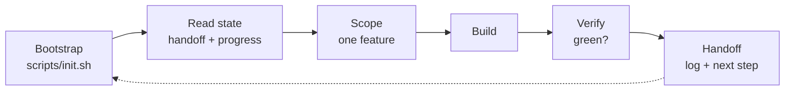

# P5 — Lifecycle: every session starts and ends the same way

*~8 min · Pillar: Lifecycle · [Score your repo →](/diagnose)*

::: tip Scorecard — this lesson is worth up to +20
Satisfy all four and you max out the Lifecycle pillar:
1. A bootstrap script (`scripts/init.sh`) that starts a session cleanly.
2. The session workflow is documented (start: bootstrap + read state; end: log + handoff).
3. The handoff doc has an actual checklist — not just a heading.
4. Instructions point the agent at `PROGRESS.md` / `feature_list.json` on startup.
:::

## The pain

Every session begins the same chaotic way.

The agent boots up, doesn't know if dependencies are installed, runs a command, hits "module not found," installs something, picks a random file to read, guesses what you were doing, and *then* starts working. Ten minutes gone before a single useful line is written.

At the end, it's worse. The session just... stops. The agent says "all done!" and vanishes. No log of what happened. No note about what's next. The repo is left mid-thought, sometimes with uncommitted junk and a half-finished test. Tomorrow you start the chaos over again, from a slightly broken starting point.

There's no ritual. Each session is a fresh improvisation, and improvisation is where reliability goes to die.

## The idea

**A session is a loop, and loops need a clean start and a clean stop.**

Think of an airplane. Pilots don't "wing it." Every flight begins with the same pre-flight checklist and ends with the same shutdown checklist. The checklist is boring on purpose — boring is what keeps the plane in the air.

Your harness needs the same two rituals:

- **Startup.** Run a bootstrap script so the environment is identical every time, then read the state files so the agent knows where it is.
- **Shutdown.** Log what happened, update the backlog, and write the exact next step into a handoff note.

This is the **Reliability Loop** made concrete: *Bootstrap → Scope → Build → Verify → Handoff → repeat.* Lifecycle is the pillar that nails down the first and last steps — the parts everyone skips and everyone regrets skipping.

<BeforeAfter before-label="Prompt-only" after-label="With harness">
<template #before>

**New session, no ritual:**

> **You:** Continue the work.
>
> **Copilot:** Sure! ...running tests... `command not found: pytest`. Let me install dependencies. ...Now, what were we working on? Let me read a few files and guess. I think it was the auth feature?

*(Twelve minutes of setup-and-guess before any real work. Half wrong.)*

</template>
<template #after>

**New session, with ritual:**

> **You:** Start the session.
>
> **Copilot:** Running `scripts/init.sh`... deps installed, verify passed (green). Reading `SESSION_HANDOFF.md`: next step is the invoices migration. Reading `PROGRESS.md` and `feature_list.json` for context. Ready — picking up exactly where we left off.

*(Thirty seconds. Identical environment. Zero guessing.)*

</template>
</BeforeAfter>

## Copilot in practice

**1. Write the bootstrap script — `scripts/init.sh`.** One command that installs everything and proves the environment is healthy before any work begins.

```bash
#!/usr/bin/env bash
# scripts/init.sh — start a session from a known-good state.
set -euo pipefail

echo "==> Installing dependencies"
npm ci

echo "==> Verifying the environment is healthy"
npm run typecheck
npm test -- --run

echo "==> Showing where we left off"
echo "--- SESSION_HANDOFF.md ---"
cat SESSION_HANDOFF.md 2>/dev/null || echo "(no handoff yet)"

echo "==> Bootstrap complete. Environment is green. Ready to work."
```

Make it executable once: `chmod +x scripts/init.sh`. Now *every* session — yours or the agent's — begins from the same green baseline. Install plus verify, in one place.

**2. Document the workflow in `.github/copilot-instructions.md`.** Make the ritual a written rule, not a hope.

```markdown
## Session workflow

### On startup (always, before any task)
1. Run `scripts/init.sh` and confirm it ends green.
2. Read SESSION_HANDOFF.md — the exact next step.
3. Read PROGRESS.md (latest entry) and feature_list.json for context.

### On shutdown (always, before saying "done")
1. Append a dated entry to PROGRESS.md.
2. Update feature_list.json statuses.
3. Rewrite SESSION_HANDOFF.md with the EXACT next step.
4. Make sure git is clean (commit or stash — no stray files).
```

**3. Give the handoff doc a real checklist — `SESSION_HANDOFF.md`.** A heading that says "Handoff" with nothing under it scores zero. The checklist is the whole point.

```markdown
# Session handoff

**State:** invoices migration in progress (mig-3).

## Resume checklist
- [ ] Run `scripts/init.sh` — confirm it ends green.
- [ ] Open `prisma/migrations/` and copy the two-pass pattern from
      PROGRESS.md (2026-06-27 entry).
- [ ] Write the invoices migration: insert rows, then backfill the FK.
- [ ] Run `npm run db:verify` — must print "0 orphaned rows".
- [ ] Mark mig-3 "done" in feature_list.json, start mig-4.

## Watch out
- [ ] Do NOT drop `legacy_id` yet (rollback safety — see DECISION).
```

Each line is something the next session can *check off*. That's the difference between a note and a launchpad.

**Useful in practice:**
- A custom task or `/` command that just runs `scripts/init.sh`, so "start the session" is one keystroke for humans too.

## Universal pattern

Lifecycle is tool-agnostic — it's a script plus a written ritual. Drop this into `AGENTS.md` so any agent inherits it:

```markdown
## Session lifecycle
- START: run `scripts/init.sh` (install + verify), then read
  SESSION_HANDOFF.md, PROGRESS.md, feature_list.json.
- END: append PROGRESS.md, update feature_list.json, rewrite
  SESSION_HANDOFF.md with the exact next step, leave git clean.
```

The mental model, every single session:



Same entry, same exit, every time. That repetition *is* the reliability.

::: details Go deeper (teams & advanced)
- **One script, many entry points.** Humans, CI, and agents should all start with the same `init.sh`. If onboarding a new engineer needs steps the script doesn't cover, the script is incomplete.
- **Fail loud, fail early.** `set -euo pipefail` means a broken environment stops the script instead of silently limping into a session. A red bootstrap is a feature — it catches the problem before the agent builds on sand.
- **Idempotent by design.** Running `init.sh` twice should be safe. `npm ci` (not `npm install`) gives a clean, lockfile-exact install every time — no drift between sessions.
- **The handoff is a contract with your future self.** Treat an empty or vague handoff as a bug. If the next session has to re-plan, the previous session didn't finish its job.
:::

## Try it

1. Create `scripts/init.sh` for your project — install dependencies, then run your fastest verification (typecheck or a quick test). End with a clear "ready" line.
2. Add the **Session workflow** block to `.github/copilot-instructions.md`.
3. Give `SESSION_HANDOFF.md` a real checklist with checkbox items, not just a heading.

Then open a fresh chat and say "start the session." Watch the agent run bootstrap, confirm green, and read the handoff before doing anything. If it skips a step, tighten the rule and rerun.

## Checkpoint

1. What two rituals does the Lifecycle pillar add to every session?
2. Why run `scripts/init.sh` at the start instead of letting the agent install things ad hoc?
3. Why does a `SESSION_HANDOFF.md` with only a heading score zero on this pillar?

<details>
<summary>Answers</summary>

1. A clean **startup** (bootstrap the environment + read the state files) and a clean **shutdown** (log progress, update the backlog, write the exact next step, leave git clean).
2. It makes the environment identical and verified-green every session, so work starts from a known-good baseline in seconds instead of minutes of ad-hoc install-and-guess that can leave things subtly broken.
3. The criterion requires an *actual checklist* — concrete, checkable next steps. A bare heading gives the next session nothing to act on, so it has to re-plan and guess, which defeats the purpose of a handoff.

</details>

## Further reading

- Course: [M06 — Every session starts the same way](./p5-lifecycle) for bootstrap patterns.
- [VS Code: custom instructions](https://code.visualstudio.com/docs/copilot/copilot-customization) — where to put the session workflow rules.
- Next: [O1 — Observability & handoff: leave the runway clean](./o1-observability-and-handoff)
