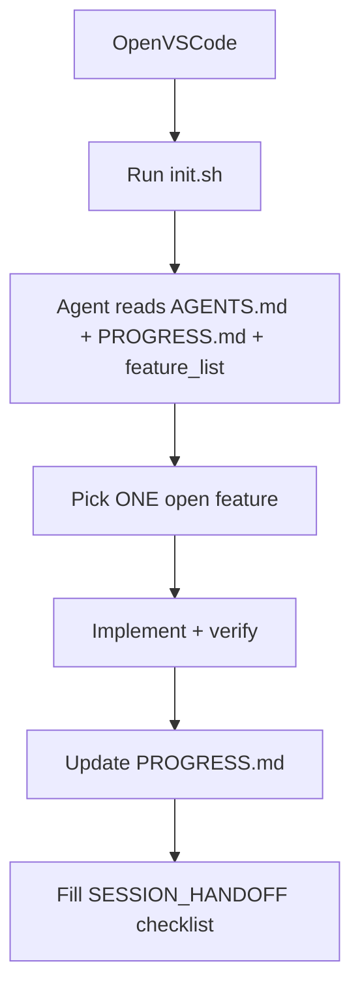

# Setup: VS Code Copilot

*~10 min read · Prerequisites: [Glossary](./glossary)*

This course assumes **GitHub Copilot in VS Code** as the primary agent for labs and templates. Your organization likely already has this — perfect.

## What you need

- VS Code 1.9+ with the **GitHub Copilot** and **GitHub Copilot Chat** extensions
- A GitHub account with Copilot access (individual, business, or enterprise)
- A repository to practice on (your lab repo or a throwaway clone)

## Enable repository customizations

Copilot reads customization files from your workspace automatically. Key locations:

| File | Purpose |
|------|---------|
| `.github/copilot-instructions.md` | Project-wide rules (always on) |
| `.github/instructions/*.instructions.md` | Rules scoped to file patterns |
| `AGENTS.md` | Multi-agent portable instructions |
| `.github/agents/*.agent.md` | Specialized personas (reviewer, planner) |
| `.github/skills/*/SKILL.md` | Reusable workflow skills |

Optional: enable **repository custom instructions discovery** in VS Code settings so monorepo subfolders inherit parent repo rules (`chat.instructionsFilesLocations` and related settings — see [VS Code customization docs](https://code.visualstudio.com/docs/copilot/customization/overview)).

## Bootstrap your first harness (10 minutes)

### Step 1 — Generate base instructions

Open your repo in VS Code. In Copilot Chat, run:

```text
/init
```

Review and edit the generated `.github/copilot-instructions.md`. Keep it under ~100 lines.

### Step 2 — Add universal harness files

Copy from this repo's [`templates/universal/`](https://github.com/dharmiksoni/agent-harness-blueprint/tree/main/templates/universal):

- `AGENTS.md`
- `PROGRESS.md`
- `feature_list.json`
- `scripts/init.sh`

Customize stack versions and verification commands for your project.

### Step 3 — Add Copilot-specific files

Copy from [`templates/copilot/minimal/`](https://github.com/dharmiksoni/agent-harness-blueprint/tree/main/templates/copilot/minimal):

- `.github/copilot-instructions.md` (merge with `/init` output if needed)
- `.github/instructions/tests.instructions.md` (example scoped rules)

### Step 4 — Validate

```bash
bash scripts/validate-harness.sh .
```

Fix any reported gaps before your first real agent task.

## Session workflow with Copilot

Use this rhythm every time:



**Starter prompt for Copilot Chat:**

```text
Read AGENTS.md, PROGRESS.md, and feature_list.json.
Run scripts/init.sh and fix any failures before coding.
Pick exactly one feature marked "open" and work only on that.
Run all verification commands in AGENTS.md before saying done.
Update PROGRESS.md when finished.
```

## Copilot slash commands you'll use

| Command | When |
|---------|------|
| `/init` | First-time project instructions |
| `/create-instruction` | Add scoped rules for a folder or file type |
| `/create-agent` | Scaffold a custom agent persona |
| `/create-skill` | Package a repeatable workflow |

## Troubleshooting

| Symptom | Likely fix |
|---------|------------|
| Copilot ignores your rules | Confirm file is `.github/copilot-instructions.md` at workspace root |
| Rules too long, agent drifts | Split into `.github/instructions/*.instructions.md` with `applyTo` globs |
| Agent forgets last session | Add or enforce `PROGRESS.md` + handoff in `copilot-instructions.md` |
| Agent says done but tests fail | Add explicit verification commands and "do not claim done until they pass" |

## Next step

Read [M03 — The five pillars](../modules/m03-the-five-pillars), then try [Lab 01](../labs/lab-01-baseline-vs-harness).
